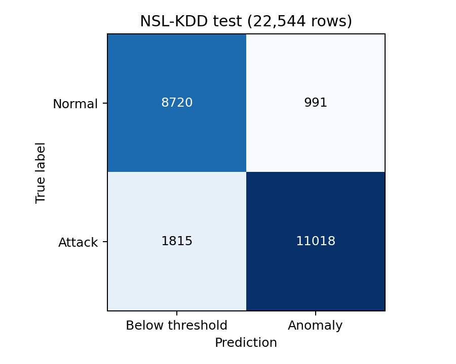

# Ağ Anomali Tespit Uygulaması

**Mehmet Ali Göç — Mehmet Akif Ersoy Üniversitesi**

NSL-KDD biçimindeki ağ bağlantı kayıtlarını autoencoder ile değerlendiren, Streamlit arayüzlü bir öğrenci projesidir. Model yalnızca normal trafikle eğitilir; yeniden oluşturma hatası kayıtlı eşiği aşan bağlantılar anomali olarak işaretlenir.

Bu sürüm çevrimdışı bir araştırma prototipidir. Canlı paket toplama, trafik engelleme veya doğrulanmış güncel saldırı / zero-day tespiti içermez. Girdinin 41 NSL-KDD özelliği önceden çıkarılmış olmalıdır.

## Hızlı başlangıç

Python 3.12 ile test edilmiştir. Proje klasöründe Windows PowerShell üzerinden:

```powershell
py -3.12 -m venv .venv
.venv\Scripts\python.exe -m pip install -r requirements.txt
.venv\Scripts\python.exe scripts/prepare_data.py
.venv\Scripts\python.exe -m streamlit run app.py
```

Hazır `models/ae_v2` modeli dahildir; yeniden eğitim gerekmez. Ham veri ve örnek CSV'ler depoya dahil edilmez. `prepare_data.py`, ilk çalıştırmada KDDTest+ dosyasını indirir, kayıtlı SHA-256 değerini kontrol eder ve 5.000 kayıtlık örnek ile iki tek kayıt örneğini yerelde oluşturur. İlk veri hazırlığı internet gerektirir; dosyalar hazır olduktan sonra analiz çevrimdışı çalışır.

Elinde aynı KDDTest+ dosyası varsa indirmeden kullanabilirsin: `python scripts/prepare_data.py --source "DOSYANIN_YOLU"`. Veri kaynağı ve kullanım koşulları için aşağıdaki bölüme bak.

“Örnek test dosyası” seçeneğiyle 5.000 kaydı analiz edebilirsin. Tek kayıt sekmesinde 41 özelliğin tamamı görülebilir ve düzenlenebilir. Eski, yalnızca 6 özellik içeren CSV dosyaları kabul edilmez; eksik 35 özellik sıfırla tamamlanmaz. Veri hazırlanmadan açılan uygulama hazırlık adımını gösterir.

## Rapor ve proje durumu

[Teknik rapor (PDF)](docs/Proje_Raporu.pdf) · [Raporun metin sürümü](docs/Proje_Raporu.md) · [Paket notları](docs/PAKET_NOTLARI.md)

Model sonuçları 25 Eylül 2026 deneyine aittir. İlk tam çalışma kopyasında 23 otomatik test geçmiştir; GitHub paketinin kontrol kayıtları [ayrı notta](reports/PAKET_DOGRULAMA.md) tutulur. Kullanıcının kendi ortamında gerçek tarayıcı üzerinden denemesi henüz tamamlanmamıştır.

## Tekrarlanabilir deney

```powershell
.venv\Scripts\python.exe scripts/download_data.py
.venv\Scripts\python.exe evaluate.py
.venv\Scripts\python.exe train.py --version ae_v3 --epochs 20
```

Yeni eğitim mevcut model klasörünü ezmez; genel `reports/loss.png` ve `reports/confusion_matrix.png` dosyalarını yeniden yazar. Yeni deney öncesi önceki grafikleri arşivle. Arayüz varsayılan olarak `ae_v2` paketini kullanır; başka sürüm kullanmak için `app.py` içindeki `MODEL_DIR` değerini değiştir. Kendi deneylerinde test sonuçlarına bakarak sürekli model/eşik seçmek test kümesine dolaylı uyum sağlar; model seçimlerini eğitim ve doğrulama verisiyle yap.

### Veri ayrımı

KDDTrain+ içindeki 125.973 kayıt, sınıf oranları korunarak sabit tohumla (42) ayrılır:

| Bölüm | Tüm kayıtlar | Autoencoder'ın kullandığı normal kayıtlar | Amaç |
|---|---:|---:|---|
| Eğitim | 100.778 | 53.874 | Ön işleme ve model öğrenimi |
| Doğrulama | 12.597 | 6.734 | Eğitim takibi / erken durdurma |
| Kalibrasyon | 12.598 | 6.735 | Karar eşiği |

KDDTest+ dosyasının **22.544 kaydı** ayrı son değerlendirmede kullanılır. Sayısal ölçekleyici ve kategorik kodlayıcı yalnızca normal eğitim bölümünde öğrenilir. Kalibrasyon eşiği, normal kalibrasyon hatalarının %95 yüzdeliğidir (`method='higher'`). Test etiketleri eşiği belirlemez.

Bu sürümün eşiği **0,01442244645**; kalibrasyonda gözlenen yanlış alarm oranı **%4,99**'dur. Bu oran, farklı dağılımdaki test verisinde veya gerçek ağda %5 yanlış alarm garantisi vermez. Bu test kümesi önceki proje incelemesinde de görülmüştür; sonuç tamamen yeni ve hiç incelenmemiş bir dış veri kümesinde doğrulama iddiası taşımaz.

### Model

38 sayısal özellik MinMaxScaler ile ölçeklenir; 3 kategorik özellik one-hot kodlanır. Bu eğitim bölümünde oluşan toplam boyut **77**'dir. Kodlama boyutu sabit bir varsayım değildir; model manifestine kaydedilir. Ağ: `77 → 64 → 32 → 16 → 32 → 64 → 77`, iki Dropout(0,2), ReLU gizli katmanlar, sigmoid çıkış, Adam ve MSE. Toplam 15.261 parametre; 20 dönem, 256 kayıtlık gruplar. Eğitimde görülmeyen kategoriler sıfır one-hot vektörüyle temsil edilir ve arayüzde uyarı gösterilir.

## Kaydedilen sonuçlar

25 Eylül 2026 tarihli `ae_v2` deneyi; KDDTest+ (9.711 normal, 12.833 saldırı):

| Ölçüm | Autoencoder | Random Forest karşılaştırması |
|---|---:|---:|
| Doğruluk | %87,55 | %77,38 |
| Kesinlik (precision) | %91,75 | %96,88 |
| Saldırı yakalama (recall) | %85,86 | %62,26 |
| F1 | %88,70 | %75,81 |
| Normal trafikte yanlış alarm | %10,20 | %2,65 |
| ROC-AUC | 0,9324 | 0,9594 |

Random Forest, aynı %80 eğitim bölümündeki normal ve saldırı etiketleriyle, 100 ağaç ve sabit tohumla eğitilen bir referanstır; hiperparametre araması yapılmamıştır. Ön işlemesi kendi eğitim bölümünde öğrenilir. İki yöntemin öğrenme amaçları ve karar kuralları farklıdır. Autoencoder'ın bu eşikteki F1 değeri yüksekken Random Forest daha az yanlış alarm üretir ve ROC-AUC değeri daha yüksektir; tüm ölçütlerde üstünlük iddiası yoktur. Random Forest ağırlıkları pakette saklanmaz; `train.py` ile yeniden üretilir. Önceki not defterindeki XGBoost sonuçları bu yeni deneyde yeniden ölçülmediği için bu tabloya taşınmamıştır.

| Gerçek sınıf / Model kararı | Eşik altında | Anomali |
|---|---:|---:|
| Normal | 8.720 | 991 |
| Saldırı | 1.815 | 11.018 |

Sonuçların kaynağı `reports/ae_v2.json` dosyasıdır. `reports/confusion_matrix.png` ve `reports/loss.png` bu deneyden üretilmiştir. Saldırı türüne göre sonuçlar JSON'da ayrıca bulunur: örneğin `mailbomb` yakalama oranı yalnızca %4,78; `back` %14,76'dır. Genel doğruluk bu zayıflıkları gizlememelidir. Çok az örnekli sınıfların oranları güçlü genelleme kanıtı değildir.



## Girdi ve çıktı

- CSV, UTF-8 kodlamalı ve virgülle ayrılmış olmalı; özellik listesi `ids/schema.py` içindedir.
- `True_Class` isteğe bağlıdır: 0 normal, 1 saldırı. Varsa metrikler hesaplanır; yoksa yalnızca skor ve karar gösterilir.
- Eksik özellikler, NaN/sonsuz değerler, geçersiz sayılar ve etiketler reddedilir. Tek sınıflı girdilerde tanımsız metrikler açıkça gösterilir.
- Yükleme sınırı 25 MB ve 50.000 kayıttır. Skor büyüklüğü bir saldırı olasılığı değildir.
- Çıktı CSV'si `AnomalyScore`, `Prediction` ve `Durum` alanlarını içerir.
- Deneysel eşik ayarı yalnızca arayüzdeki analizi etkiler; model manifestini veya kayıtlı raporu değiştirmez.

## Testler

```powershell
.venv\Scripts\python.exe -m pip install -r requirements-dev.txt
.venv\Scripts\python.exe -m pytest -q
```

Testler hatalı girdileri, tek sınıflı ölçümleri, ön işleme tutarlılığını, kayıtlı modelin yeniden yüklenmesini ve Streamlit örnek analiz akışlarını kapsar. Veri hazırlanmadan örnek ve tam test kontrolleri atlanır; ilk açılış yönlendirmesi kontrol edilir. `prepare_data.py` çalıştırıldıktan sonra örnekler ve tam test verisi kullanılabilir. Bölüm indeksleri pakette bulunmaz; ilgili kontrol atlanır. `pytest -rs` atlama nedenlerini listeler.

## Dosyalar

`app.py`: arayüz · `train.py`: eğitim ve raporlama · `evaluate.py`: sabit model testi · `ids/`: ortak şema, ön işleme ve metrikler · `models/ae_v2/`: model, ön işleyici ve manifest · `tests/`: doğrulama · `docs/`: proje anlatımı ve geliştirme notları.

## Veri kaynağı ve sınırlar

Kaynak dosyalar orijinal not defterindeki `defcom17/NSL_KDD` GitHub aynasıyla eşleşir. İndirme betiği tam dosya SHA-256 değerlerini kontrol eder; bu kontrol kaynağın resmî olduğunu veya veri lisansını doğrulamaz. Kaynak: https://github.com/defcom17/NSL_KDD . Ham veriler `.gitignore` ile hariç tutulur. Yeniden dağıtım öncesinde veri kullanım koşullarını ayrıca kontrol et.

NSL-KDD sonuçları güncel kurumsal ağlarda başarı kanıtı değildir. Zamansal ayrım, farklı veri kümesi, gerçekçi özellik çıkarımı, alarm incelemesi ve çalışma hızı değerlendirmesi gelecekte yapılmalıdır. Model paketlerini yalnızca güvendiğin yerel kaynaktan yükle; manifest hash'i dosya tutarlılığı kontrolüdür, dijital imza değildir.

## Lisans durumu

Kod için lisans henüz seçilmedi. Bu paket bir açık kaynak lisansı atamaz. Veri kümesi ve kullanılan bağımlılıkların koşulları ayrıdır. Paylaşım kapsamı ve dışarıda bırakılan dosyalar [paket notlarında](docs/PAKET_NOTLARI.md) açıklanır.
